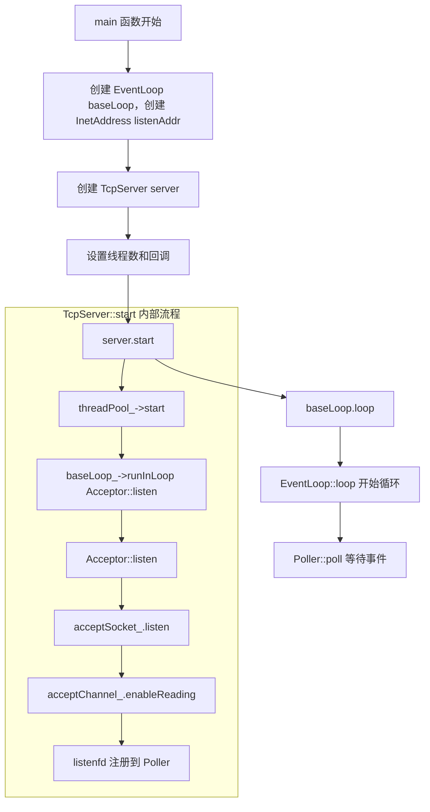
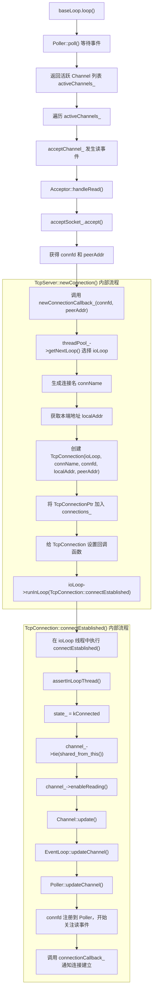
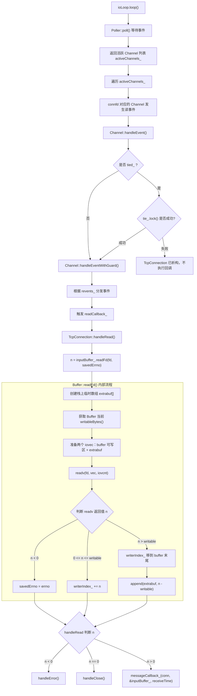
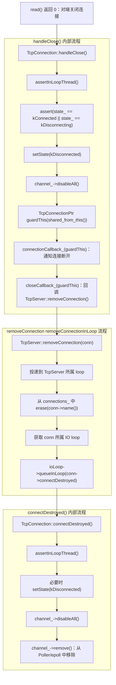

# mini-muduo

一个参考 `muduo` 核心设计实现的 `C++ Reactor` 网络库原型，包含 `base` 基础组件和 `net` 网络组件，支持异步日志、one loop per thread、多线程 IO、`poll` 事件分发、 `epoll` 事件分发、`eventfd` 跨线程唤醒、`timerfd` 定时器、非阻塞 TCP 连接管理和 `Buffer` 收发机制。

本项目主要用于学习和验证 Linux/C++ 高性能网络库的核心机制。

---

## 1. 项目简介

`mini-muduo` 是一个基于 `Reactor` 模型的 C++ 网络库原型，目标是实现一个可运行、可压测、可解释的 TCP server 框架。

项目分为两层：

- `base`：日志、线程、同步、时间戳等基础组件
- `net`：`EventLoop`、`Channel`、`Poller`、`TcpServer`、`TcpConnection`、`Buffer` 等网络组件

当前主要支持服务端 TCP 网络编程，已完成 `echo server` 示例，并使用自写 `epoll ping-pong client` 进行多连接压测。

---

## 2. 核心特性

- Reactor 事件驱动模型
- one loop per thread 线程模型
- 基于 `poll` 或 `epoll` 的 IO multiplexing
- `eventfd` 实现跨线程 `wakeup`
- `timerfd` 实现定时器
- `TcpServer / TcpConnection` 连接管理
- `Buffer` 输入/输出缓冲区
- 非阻塞 TCP 读写
- `outputBuffer_` 处理 `write` 写不完问题
- `EventLoopThreadPool` 多线程 IO
- `runInLoop` / `queueInLoop` 跨线程任务投递
- `AsyncLogging` 异步日志
- ASan / TSan / fd 泄漏 / 压测验证

---
## 3. 项目结构

```text
.
├── base
│   ├── AsyncLogging.cc
│   ├── AsyncLogging.h
│   ├── Atomic.h
│   ├── Condition.cc
│   ├── Condition.h
│   ├── copyable.h
│   ├── CountDownLatch.cc
│   ├── CountDownLatch.h
│   ├── CurrentThread.cc
│   ├── CurrentThread.h
│   ├── Exception.cc
│   ├── Exception.h
│   ├── FileUtil.cc
│   ├── FileUtil.h
│   ├── LogFile.cc
│   ├── LogFile.h
│   ├── Logging.cc
│   ├── Logging.h
│   ├── LogStream.cc
│   ├── LogStream.h
│   ├── Mutex.h
│   ├── noncopyable.h
│   ├── StringPiece.h
│   ├── Thread.cc
│   ├── Thread.h
│   ├── Timestamp.cc
│   ├── Timestamp.h
│   └── Types.h
├── net
│   ├── Acceptor.cc
│   ├── Acceptor.h
│   ├── Buffer.cc
│   ├── Buffer.h
│   ├── Callbacks.h
│   ├── Channel.cc
│   ├── Channel.h
│   ├── Endian.h
│   ├── EventLoop.cc
│   ├── EventLoop.h
│   ├── EventLoopThread.cc
│   ├── EventLoopThread.h
│   ├── EventLoopThreadPool.cc
│   ├── EventLoopThreadPool.h
│   ├── InetAddress.cc
│   ├── InetAddress.h
│   ├── poller
│   │   ├── DefaultPoller.cc
│   │   ├── EPollPoller.cc
│   │   ├── EPollPoller.h
│   │   ├── PollPoller.cc
│   │   └── PollPoller.h
│   ├── Poller.cc
│   ├── Poller.h
│   ├── Socket.cc
│   ├── Socket.h
│   ├── SocketsOps.cc
│   ├── SocketsOps.h
│   ├── TcpConnection.cc
│   ├── TcpConnection.h
│   ├── TcpServer.cc
│   ├── TcpServer.h
│   ├── Timer.cc
│   ├── Timer.h
│   ├── TimerId.h
│   ├── TimerQueue.cc
│   └── TimerQueue.h
├── examples
│   └── echo.cpp
├── scripts
│   ├── asan_build.sh
│   ├── ping-pong.cc
│   └── run_echo_bech.sh
├── docs
│   ├── benchmark.md
│   └── design_notes.md
├── CMakeLists.txt
└── README.md

```
___
## 4.架构设计
### 4.1 整体结构
```text
TcpServer
 ├── Acceptor
 ├── EventLoopThreadPool
 │    ├── EventLoopThread
 │    └── EventLoop
 └── TcpConnection
      ├── Channel
      ├── Socket
      ├── inputBuffer_
      └── outputBuffer_

EventLoop
 ├── Poller / EPollPoller
 ├── TimerQueue
 ├── wakeupFd
 └── pendingFunctors

```

### 4.2 线程模型
本项目采用了one loop per thread 模型。
- main loop 负责监听`socket` 和 `accept` 新连接
- IO loop负责具体连接的读写操作
- 每个`TcpConnection`只属于一个`EventLoop`
- `Channel / Poller` 操作必须在所属 `EventLoop` 线程中进行
- 跨线程操作通过 `runInLoop` / `queueInLoop` 投递
___
## 5. Base 基础组件
## 5.1 Logger
实现了日志功能
+ `LogStream`：提供 operator<< 接口，负责把 bool、整数、浮点数、指针、字符串等类型转换成字符序列，并写入内部缓冲区
	+ `FixedBuffer`：提供固定大小的字符数组和 `append`/`reset`/`avail`/`length` 等基础操作，是 `LogStream` 的底层存储。
	  `FixedBuffer` = 一块固定大小的连续内存 + 当前写指针
	+ `Fmt`：基于 `snprintf` 的小型格式化辅助类，用来把指定格式的数据提前格式化成一段字符串，便于写入 `LogStream`。
+ `Logger`：一次日志记录的入口对象。`LOG_INFO` / `LOG_ERROR` 等宏会构造一个临时 `Logger` 对象，`Logger` 内部持有 `Impl`，真正的日志前缀、级别、时间、线程号、文件名、行号等格式化工作由 `Impl` 完成。
	+ `SourceFile`：负责保存并裁剪源文件名。它接收 `__FILE__` 传进来的路径，把 `/home/xxx/project/net/TcpServer.cc` 裁成 `TcpServer.cc`，避免日志里打印完整路径。
	+ `Impl`：`Logger` 的实现体，持有 `LogStream`、日志级别、行号、`SourceFile` 等信息。
	  构造 `Impl` 时会先把时间、线程 id、日志级别等前缀写入 `LogStream`；析构 `Logger` 时会调用 `Impl::finish()`，把文件名、行号、换行符等后缀写入 `LogStream`。
### 5.2 AsyncLogging
实现了双缓冲异步日志系统。前端线程负责将日志格式化到内存 `buffer`，后台日志线程批量将 `buffer` 写入文件，减少业务线程直接写磁盘造成的阻塞。
+ 
+ `AsyncLogging`分成前端`append`和后端`threadFunc`。
	+ 前端`append`负责将日志内容写入`currentBuffer_`。
	   如果`currentBuffer_`空间足够，就直接`append`。
	   如果`currentBuffer_`写满，就把`currentBuffer_`移入`buffers_`，通知后端线程。
	   然后优先使用`nextBuffer_`作为新的`currentBuffer_`;如果`nextBuffer_`已经被用掉，就临时new一个新的`Buffer`.
	   因此当前端写入速度远大于后端落盘速度时，`buffers_`中会积压多个`buffer`，也可能发生额外内存分配。
	+ 后端`threadFunc`负责把`buffer`内容写入`LogFile`。
	   它会通过条件变量等待：要么被前端唤醒，要么超时自动醒来做`flush`。
	   醒过来后，后端在锁内把`currentBuffer_`也移入`buffers_`，然后用`newBuffer1`来替换`currentBuffer_`，再把`buffers_`和`bufferToWrite`交换。
	   如果`nextBuffer_`为空，则用`newBuffer2`补充`nextBuffer_`。
	   这样锁内操作很短，前端可以尽快继续写日志。

	  锁外，后端遍历`buffersToWrite`，把每个`buffer`的内容`append`到`LogFile`。
	  写完后，后端最多保留两个空`buffer`作为`newBuffer1`和`newBuffer2`继续复用，多余的`buffer`会随着`unique_ptr`析构被释放。
	  随后清空`buffersToWrite`，并`flush`到文件。
+ `LogFile` 和 `FileUtil`
	+ `AppendFile`封装`FILE*`，负责把日志内容追加写入`fp_`，并维护`writtenBytes_`和`flush`操作
	+ `LogFile`持有`AppendFile`，负责日志文件管理。它可以根据`basename`、时间、主机名、`pid`生成日志文件名；当文件大小超过`rollSize_`或跨天滚动到新文件；同时根据`append()`对外接口，根据是否启用`threadSafe`决定是否加锁，最终调用`appned_unlocked()`写入`AppendFile`。`LogFile`还会根据`flushInterval_`定期`flush`，保证日志不会长期停留在用户态缓冲区。
	
### 5.3 Thread / MutexLock / Condition / CountDownLatch
封装 pthread 线程、互斥锁、条件变量和启动同步工具，为 EventLoopThread、AsyncLogging 等模块提供基础并发能力。
+ `Thread`类是对`pthread`的`C++`封装，负责保存线程函数、线程名、线程id，并提供`start()`和`join`管理线程生命周期。
   `start()`是对外启动接口，内部调用`pthread_create()`创建线程。`pthread_create()`要求传入一个`void*(*)(void*)`形式的线程入口函数，所以`muduo`定义了`startThread(void*)`作为适配器。
   `ThreadData`是传给`startThread`的参数，里面保存了真正要执行的函数`func_`、线程名`name_`、用于写回`tid_`的指针，以及用于同步线程启动完成的`CountDownLatch`。新线程启动后，`startThread`会把`void*`转回`ThreadData*`，调用`runInThread()`，完成`tid`写回、线程名设置、`latch`通知，最后执行用户函数`func_`。
+ `MutexLcok`类是对`pthread_mutex_t`的封装，内部用`holder_`记录当前持有锁的线程`tid`，主要用于调试和断言。`MutexLcokGuard`通过`RAII`在构造时加锁、析构时解锁，避免手动`unlock`遗漏。
   `MutexLock`内部的`UnassignGuard`专门配合`Condition::wait()`使用。因为`pthread_cond_wait`会在等待时临时释放`mutex`，并在返回前重新获得`mutex`，所以`UnassignGuard`会在进入`wait`前清空`holder_`，在`wait`返回后重新设置`holder_`，保证`holder_`状态和真实锁状态一致。
+ `Condition`类是对`pthread_cond_t`的封装，基于`MutexLcok`实现了`wait`、`notify`、`notifyAll`。`wait()`会原地释放`mutex`并阻塞等待，被唤醒后重新获得`mutex`再返回，因此通常要放在`while`循环里检查条件。
+ `CountDownLatch`类内部由`MutexLcok`、`Condition`和`count_`组成。`wait()`在`count_`大于0时通过`condition_.wait()`阻塞等待，等待期间会释放`mutex`；`countDown()`每次将`count_`减1，当`count_`变成0时`notifyAll()`唤醒所有等待线程。它常用于一个线程等待其他线程完成初始化或任务阶段。
## 5.4 Timestamp
`Timestamp`是一个轻量级时间点类
`Timestamp`内部用`int64_t` `microSecondsSinceEpoch_`保存从`Unix Epoch`到该时间点经过的微秒数。
它支持获取当前时间`Timestamp::now()`，支持时间点之间的大小比较和相等比较，方便在`TimerQueue`的`set`中按到期排序。
它还提供`toStirng()`和`toFormattedString()`，用于把内部微秒数转换成人类可读的字符串，常用于日志输出。
此外，`Timestamp`还配合`addTime()`使用，可以在某个时间点上增加指定的秒数，生成新的过期时间，主要服务于定时器模块。

___
## 6. Net 基础组件
### 6.1Channel
+ `Channel`是对一个`fd`及其事件的封装。它保存了`fd_`关注的事件`events_`、`Polle`返回的实际就绪事件`revents_`，以及读、写、关闭、错误等回调函数。
+ `Channel`持有所属`EventLoop`的指针`loop_`，但它不直接操作`epoll/poll`。每次修改事件，比如`enableReading`、`enableWriting`、`disableWriting`、`disableAll`，最终都会调用`update()`，通过`EventLoop`转发给`Poller`，由`Poller`真正执行`epoll_ctl`/`poll`相关更新。
+ `EventLoop`调用`Poller::poll()`得到活跃`Channel`列表后，会遍历`activeChannels_`，调用每个`Channel`的`handleEvent()`。然后分发到对应的回调，比如`readCallback_`、`writeCallback_`、`closeCallback_`、`errorCallback_`。
+ `Channel`内部还可以通过tie()保存`TcpConnection`的`weak_ptr`。`handleEvent()`时会先尝试`weak_ptr.lock()`得到`shared_ptr`，确保回调执行期间`TcpConnection`不会被析构，然后通过`handleEventWithGuard()`分发到对应的回调。如果`lock`失败，说明`TcpConnection`已经不存在了，就不再执行回调。
### 6.2 Poller
+ `Poller`是`IO`多路复用的抽象基类，底层可以有`PollPoller` 和 `EpollPoller`两种实现。它维护`fd`到`Channel*`的映射，通过`updateChannel()`和 `removeChannel()`管理`Channel`再底层`poll`和`epoll`中的注册状态。
+ `EventLoop`在`loop()`中调用`Poller::poll()`等待`IO`事件。`PollPoller`底层调用`poll()`，`EPollPoller`底层调用`epoll_wait()`。当有事件发生后，`Poller`通过`fillActiveChannels()`找到对应的`Channel`，设置`Channel`的`revents_`，并把活跃`Channel`放入`activeChannels_`返回给`EventLoop`.
+ `EventLoop`随后遍历`activeChannels_`,调用每个`Channel`的`handleEvent()`，由`Channel`根据`revents_`分发读、写、关闭、错误等回调。
### 6.3 EventLoop
+ `EventLoop`是`Reactor`的核心调度器，一个`EventLoop`通常绑定一个线程。它内部持有`Poller`、`TimerQueue`、`wakeupFd`、`wakeupChannel`和`pendingFunctors_`。
+ `EventLoop::loop()`负责循环调用`Poller::poll()`等待`IO`事件，`Poller`返回活跃`Channel`后，`EventLoop`遍历`activeChannels_`并调用`Channel::handleEvent()`分发读、写、关闭、错误等回调。
+ `EventLoop`还提供`updateChannel()`、`removeChannel`等接口，`Channel`修改关注事件不会直接操作`Poller`，而是通过`EventLoop`转发给`Poller`，最终修改`epoll/poll`中的注册状态。
+ `EventLoop`持有`TimerQueue`，并通过`runAt`、`runAfter`、`runEvery`、`cancel`提供定时任务接口，真正的`timerfd`和`Timer`管理由`TimerQueue`完成。
+ `EventLoop`还通过`eventfd`实现跨线程唤醒。当其他线程调用`queueInLoop`/`runInLoop`投递任务时，如果`EventLoop`正阻塞在`poll`中，就通过`wakeup()`与`eventfd`唤醒它。`EventLoop`被唤醒后读取`eventfd`，并在`doPendingFunctors()`中执行`pendingFunctors_`。
+ `EventLoop`通过`threadId`、`isInLoopThread()`、`assertInLoopThread()`保证线程归属，确保`Poller`、`Channel`、`TcpConnection`等核心对象的修改在正确的`IO`线程中执行。
### 6.4 Acceptor
+ `Acceptor`类负责监听新连接。它内部持有`acceptSocket_`和`acceptChannel_`，其中`acceptSocket_`管理监听`socket`的`fd`，`acceptChannel_`负责把监听`fd`的读事件注册到`EventLoop`和`Poller`。
+ `Acceptor`构造时会把`acceptChannel_`的读回调设置为`Acceptor::handleRead`。当调用`listen()`后，`acceptSocket_`开始监听端口，同时`acceptChannel_` `enableReading`，开始关注`listenfd`的可读事件。
+ 当有新连接到来时，`listenfd`可读，`EventLoop`会调用`acceptChannel_`的`readCallback_`，也就是`Acceptor::handleRead`。`handlRead()`内部调用`acceptSocket_.accept()`接受连接，得到`connfd`和对端地址`peerAddr`，然后调用`newConnectionCallback_(connfd, peerAddr)`，把新连接交给`TcpServer`处理。
### 6.5 TcpServer
+ `TcpServer`拥有`Acceptor`和`EventLoopThreadPool`的所有权。`Acceptor`负责监听新连接，`EventLoopThreadPool`负责提供`IO`线程。`TcpServer`内部的`connections_`保存所有活跃`TcpConnection`的`shared_ptr`，用于管理连接生命周期。
+ `TcpServer`构造时会给`Acceptor`设置`newConnectionCalllback_`。当`Acceptor`接受到新连接后，会调用`TcpServer::newConnection(connfd, peerAddr)`。`TcpServer`在`newConnection`中从线程池中选择一个`EventLoop`，为这个`connfd`创建`TcpConnection`，设置连接回调、消息回调、写完成回到和关闭回调，然后把`TcpConnection`存入`connections_`，最后把`connectionEstablished`投递到该连接所属的`EventLoop`中执行。
+ 关闭连接时，`TcpConnection `通过 `closeCallback_` 通知 `TcpServer`；`TcpServer` 在 `baseLoop_` 中从 `connections_` 删除 `shared_ptr`；然后再回到连接所属 `ioLoop` 中执行 `connectDestroyed()`，移除 `Channel`，完成连接生命周期收尾。
### 6.6 TcpConnection
+ `TcpConnection` 表示一条已经建立的 `TCP` 连接，负责连接上的读、写、关闭、错误处理、缓冲区管理、状态机维护和回调分发。
+ `TcpConnection` 内部持有所属 `EventLoop`、`Socket`、`Channel`、连接名、本地地址、对端地址、输入缓冲区 `inputBuffer_`、输出缓冲区 `outputBuffer_` 以及 `connectionCallback`、`messageCallback`、`writeCompleteCallback`、`closeCallback` 等回调函数。
+ 新连接由 `Acceptor` 接收，由 `TcpServer` 创建 `TcpConnection`，并存入 `connections_`。`TcpConnection` 只负责单个 `connfd` 建立后的通信逻辑。
+ 连接建立时，`TcpServer` 会把 `TcpConnection::connectEstablished()` 投递到连接所属的 `ioLoop` 中执行。`connectEstablished()` 会把状态改为 `kConnected`，调用 `channel_->tie(shared_from_this())` 保护生命周期，然后 `enableReading()` 开始关注读事件，并触发 `connectionCallback_`。
+ 当 `fd` 可读时，`EventLoop` 通过 `Channel` 调用 `TcpConnection::handleRead()`。`handleRead()` 把数据读入 `inputBuffer_`，如果读到数据则调用 `messageCallback_`，如果读到 0 则说明对端关闭，进入 `handleClose()`。
+ 发送数据时，`send()` 是跨线程安全入口。如果调用线程就是连接所属 `ioLoop`，则直接执行 `sendInLoop()`；否则通过 `runInLoop()` 投递到 `ioLoop`。`sendInLoop()` 会优先尝试直接 `write`，如果没写完，则把剩余数据放入 `outputBuffer_`，并 `enableWriting()` 等待后续可写事件。
+ 当 `fd` 可写时，`handleWrite()` 会继续发送 `outputBuffer_` 中的数据。发送完后 `disableWriting()`，必要时触发 `writeCompleteCallback_`。如果此时连接处于 `kDisconnecting` 状态，则在数据发完后执行 `shutdownInLoop()` 优雅关闭写端。
+ 连接关闭时，`handleClose()` 会把状态改为 `kDisconnected`，`disableAll()`，然后调用 `connectionCallback_` 通知用户连接断开，再调用 `closeCallback_` 通知 `TcpServer` 移除连接。`TcpServer` 会在 `baseLoop_` 中从 `connections_` 删除对应 `TcpConnectionPtr`，然后把 `connectDestroyed()` 投递到连接所属 `ioLoop` 中执行，最终 `removeChannel()`，完成连接资源清理。
### 6.7 EventLoopThread
+ `EventLoopThread` 是对`IO` 线程的封装，它内部持有 `Thread`、`mutex`、`condition`、`loop_` 指针和线程初始化回调。它的作用是在新线程中创建并运行一个 `EventLoop`。
+ `startLoop()` 会启动底层线程，然后等待新线程中的 `threadFunc()` 创建好 `EventLoop`。`threadFunc()` 在线程栈上构造 `EventLoop`，执行初始化 `callback_`，然后把 `loop_` 指向这个 `EventLoop`，并通过 `condition` 通知 `startLoop()`。随后 `threadFunc()` 调用 `EventLoop::loop()`，让该线程进入事件循环。
+ `EventLoopThread` 中的 `loop_` 只是指向新线程内 `EventLoop` 的指针，不负责堆内存所有权。`EventLoop` 的生命周期通常从 `threadFunc()` 中局部变量构造开始，到 `EventLoop::loop()` 退出、`threadFunc()` 返回时结束。
+ 析构 `EventLoopThread` 时，如果 `loop_` 仍然存在，需要调用 `loop_->quit()` 通知事件循环退出，然后 `join` 线程，保证 `IO` 线程安全结束。
### 6.8 EventLoopThreadPool
+ `EventLoopThreadPool` 是 `IO` 线程池管理类，内部持有 `baseLoop_`、线程数量 `numThreads_`、`EventLoopThread` 列表 `threads_`、`IO EventLoop` 指针列表 `loops_` 和轮询下标 `next_`。
+ `start()` 会在 `baseLoop_` 所属线程中启动线程池，根据 `numThreads_` 创建多个 `EventLoopThread`。每个 `EventLoopThread` 启动后都会在线程中创建并运行一个 `EventLoop`，`startLoop()` 返回这个 `EventLoop*`，`EventLoopThreadPool` 将其保存到 `loops_` 中。
+ `TcpServer` 收到新连接后，会调用 `EventLoopThreadPool::getNextLoop()` 选择一个 `IO` `EventLoop`。`getNextLoop()` 通常使用 `round-robin` 轮询策略，从 `loops_` 中依次返回 `EventLoop*`。如果线程池没有额外线程，也就是 `numThreads_ == 0`，则直接返回 `baseLoop_`。
+ `EventLoopThreadPool` 负责管理多个 `IO EventLoop`，并为 `TcpServer` 分配连接所属的 `EventLoop`。新连接创建后，`TcpConnection` 会绑定到选中的 `ioLoop`，后续读、写、关闭、`Channel` 更新都在该 `ioLoop` 线程中执行。
### 6.9 TimerQueue / TimerId/ Timer
+ `Timer` 表示一个定时任务，保存回调函数、到期时间、重复间隔、是否重复以及自己的 `sequence` 编号。`restart()` 用来在重复 `Timer` 到期后重新计算下一次 `expiration_`，一次性 `Timer` 到期后则设为无效。
+ `TimerId` 是暴露给用户的定时器句柄，内部保存 `Timer*` 和 `sequence_`，用于后续 `cancel`。`TimerId` 不拥有 `Timer`，只用于标识 `Timer`。
+ `TimerQueue` 是定时器管理器，内部持有 `timerfd_` 和 `timerfdChannel_`，通过 `EventLoop` 监听 `timerfd_` 的读事件。它用 `timers_` 按到期时间维护所有活跃 `Timer`，用 `activeTimers_` 维护当前有效 `Timer`，用 `cancelingTimers_` 处理回调过程中取消 `Timer` 的情况。
   `addTimer()` 负责添加定时器，最终通过 `addTimerInLoop()` 在 `EventLoop` 线程内调用 `insert()`。`insert()` 会把 `Timer` 同时加入 `timers_` 和 `activeTimers_`，并返回新 `Timer` 是否成为最早到期 `Timer`；如果是，就重新设置 `timerfd_`。
   `timerfd_` 到期后触发 `handleRead()`。`handleRead()` 先读取 `timerfd_` 清除可读事件，然后调用 `getExpired()` 取出所有已到期 `Timer`，并从 `timers_` 和 `activeTimers_` 中移除它们。随后执行这些 `Timer` 的回调函数。执行完后，`reset()` 会把需要重复执行且没有被取消的 `Timer restart` 后重新 `insert`；一次性 `Timer` 或已取消 `Timer` 则被释放。
## 7.核心流程
### 7.1 服务启动流程

### 7.2 新连接建立流程

### 7.3 读事件处理流程

### 7.4 发送数据流程

```mermaid
flowchart TD
    A["TcpConnection::send(message)"] --> B{"state_ == kConnected ?"}
    B -->|"否"| B1["连接已断开，不发送"]
    B -->|"是"| C{"loop_->isInLoopThread() ?"}

    C -->|"是"| D["直接调用 sendInLoop(message)"]
    C -->|"否"| E["loop_->runInLoop(sendInLoop)"]

    D --> F0
    E --> F0

    subgraph SendInLoop["TcpConnection::sendInLoop() 内部流程"]
        F0["进入 sendInLoop()"] --> F1["assertInLoopThread()"]
        F1 --> F2{"没有关注写事件 且 outputBuffer_ 为空 ?"}

        F2 -->|"是"| F3["先尝试 sockets::write(fd, data, len)"]
        F3 --> F4{"是否一次写完 ?"}
        F4 -->|"是"| F5["queueInLoop(writeCompleteCallback_)"]
        F4 -->|"否"| F6["计算 remaining 未发送字节数"]

        F2 -->|"否"| F7["不能直接写，全部作为 remaining"]

        F6 --> F8["检查是否超过 highWaterMark_"]
        F7 --> F8

        F8 --> F9{"第一次超过 highWaterMark_ ?"}
        F9 -->|"是"| F10["queueInLoop(highWaterMarkCallback_)"]
        F9 -->|"否"| F11["跳过高水位回调"]
        F10 --> F12["将 remaining 追加到 outputBuffer_"]
        F11 --> F12

        F12 --> F13["channel_->enableWriting()"]
        F13 --> F14["等待 fd 可写事件"]
    end

    F14 --> G0

    subgraph WriteEvent["后续 fd 可写事件流程"]
        G0["ioLoop.loop()"] --> G1["Poller::poll() 等待事件"]
        G1 --> G2["返回活跃 Channel 列表 activeChannels_"]
        G2 --> G3["遍历 activeChannels_"]
        G3 --> G4["connfd 对应的 Channel 发生写事件"]
        G4 --> G5["Channel::handleEvent()"]
        G5 --> G6{"是否 tied_ ?"}

        G6 -->|"否"| G7["Channel::handleEventWithGuard()"]
        G6 -->|"是"| G8{"tie_.lock() 是否成功 ?"}
        G8 -->|"失败"| G9["TcpConnection 已析构，不执行回调"]
        G8 -->|"成功"| G7

        G7 --> G10["根据 revents_ 分发事件"]
        G10 --> G11["触发 writeCallback_"]
        G11 --> G12["TcpConnection::handleWrite()"]
        G12 --> G13["sockets::write(fd, outputBuffer_.peek(), readableBytes)"]
        G13 --> G14{"outputBuffer_ 是否写空 ?"}

        G14 -->|"否"| G15["保留剩余数据，继续等待下次可写"]
        G14 -->|"是"| G16["channel_->disableWriting()"]
        G16 --> G17["queueInLoop(writeCompleteCallback_)"]
        G17 --> G18{"state_ == kDisconnecting ?"}
        G18 -->|"是"| G19["shutdownInLoop()"]
        G18 -->|"否"| G20["发送流程结束"]
    end
```

### 7.5 连接关闭流程

### 7.6 跨线程唤醒流程
```mermaid
flowchart TD
A["其他线程调用queueInLoop(cb)"] --> B["加锁MockLockGuard 将cb加入到任务队列pendingFunctors_.push_back(std::move(cb))"]
B --> C["如果在其他线程 或者 ]
```
### 7.7 定时器流程
### 7.8 AsyncLogging 前后端异步写日志流程
### 7.9 EventLoopThreadPool 分配连接流程
### 7.10 Channel update 到 Poller 的流程
___
## 8. 编译运行
### 8.1 普通 Debug 构建
```bash
cmake -S . -B build-debug -DCMAKE_BUILD_TYPE=Debug
cmake --build build-debug -j
```
### 8.2 Release 构建
```bash
cmake -S . -B build-release -DCMAKE_BUILD_TYPE=Release
cmake --build build-release -j
```
### 8.3 Asan 构建
```bash
cmake -S . -B build-asan \
      -DCMAKE_BUILD_TYPE=Debug \
      -DENABLE_ASAN=ON

cmake --build build-asan -j
```

运行：
```bash
ASAN_OPTIONS=abort_on_error=1:detect_leaks=1 ./build-asan/main 9981 4
```
### 8.4 Tsan 构建
```bash
cmake -S . -B build-tsan \
      -DCMAKE_BUILD_TYPE=Debug \
      -DENABLE_TSAN=ON

cmake --build build-tsan -j
```

运行
```bash
./build-tsan/main 9981 4
```
___
## 9. Echo Server 示例
运行：
```bash
./build-debug/bin/echo_server 9981 4
```

或者 `Asan` 版本:
```bash
ASAN_OPTIONS=abort_on_error=1:detect_leaks=1 ./build-asan/bin/echo_server 9981 4
```

参数含义：
```text
9981 :监听端口
4 : io线程数
```

压测：
```bash
./build-debug/bin/ping_pong 127.0.0.1 9981 64 1000 10
```

参数含义:
```text
127.0.0.1 server ip
9981      server port
64        block size
1000      connections
10        duration seconds
```
___
## 10. 测试与验证
### 10.1 Echo ping_pong 压测
测试方式：使用单线程`epoll client`建立多条TCP连接，对`echo server`进行`ping-pong`测试模式压测。每个连接在收到完整`echo block`后继续发送下一块数据。
该测试主要验证：
+ `TcpConnection`生命周期
+ `Buffer`收发
+ 非阻塞写
+ `outputBuffer_`读写
+ `EPOLLOUT`开关
+ 多连接稳定性
不代表极限吞吐

| block size | connections | duration | throughput | messages/s | closed |
| ---------: | ----------: | -------: | ---------: | ---------: | -----: |
|        64B |         100 |      10s |  1.44MiB/s |     235597 |      0 |
|        64B |        1000 |      30s |  1.17MiB/s |     576287 |      0 |
|        1KB |        1000 |      30s |  8.82MiB/s |     271325 |      0 |
|       64KB |         100 |      30s | 17.21MiB/s |       8315 |      0 |
|        1MB |          20 |      30s | 16.93MiB/s |        509 |      0 |
### 10.2 ASan 检查
测试内容:
+ heap-use-free
+ stack-use-after-scope
+ global-buffer-overflow
- double-free
- memory leak

结果：
```text
ASan 检查：在 64B × 1000 连接、64KB × 100 连接、1MB × 20 连接等 echo 压测场景下，server 无 ASan 报错、无崩溃、无断言失败
```
### 10.3 Tsan 检查
测试内容：
- data race
- 线程间未同步读写
- 锁使用错误

结果：
```text
Tsan检查：在64B × 1000 连接、64KB × 100 连接、1MB × 20 连接等 echo 压测场景下,EventLoop / TcpConnection 路径无明显 data race
```
### 10.4 fd 泄漏检查
观察命令：
```
watch -n 1 'ls /proc/$(pidof echo_server)/fd | wc -l'
```

验证方式：
```
压测过程中 fd 数随连接数上升；压测结束后 fd 数回落到初始水平附近。
```

结果：
```
压测结束后 fd 正常回落，无明显连接 fd 泄漏。
```
___
## 12. 项目难点

### 12.1 TcpConnection 生命周期

`TcpConnection` 和 `Channel` 存在回调期间对象被释放的风险。项目使用 `shared_ptr` 管理 `TcpConnection`，并通过 `Channel` 的 `tie weak_ptr` 机制保证 `handleEvent` 期间连接对象存活。

### 12.2 跨线程任务投递

`TcpConnection` 所属 `IO loop` 和调用 `send`/`close` 的线程可能不同，因此涉及 `Channel`/`Poller` 的操作必须回到所属 `EventLoop` 执行。项目通过 `runInLoop` / `queueInLoop` 和 `eventfd` `wakeup` 保证跨线程任务被正确投递。

### 12.3 非阻塞写

非阻塞 `socket` 的 `write` 可能一次写不完，需要 `outputBuffer_` 保存剩余数据，并通过 `EPOLLOUT` 继续发送。写完后必须关闭写事件，避免 `EPOLLOUT` 空转。

### 12.4 TimerQueue 取消语义

`TimerQueue` 需要处理定时器未触发、正在触发、重复触发和取消等不同状态，因此使用 `timers_`、`activeTimers_` 和 `cancelingTimers_` 管理定时器生命周期。

### 12.5 异步日志双缓冲

`AsyncLogging` 需要在保证日志完整性的同时减少业务线程阻塞。项目通过 `currentBuffer_` / `nextBuffer_` / `buffers_` 和后台线程批量写入降低锁竞争和磁盘 IO 影响。
___
## 13. 当前边界

当前项目主要实现服务端 TCP 网络库核心，暂未实现：
- TcpClient / Connector
- HTTP 协议
- RPC 框架
- SSL/TLS
- 协程
- 生产级性能优化
- 完整 CI 测试

当前压测结果主要用于验证核心链路稳定性，不代表极限性能。
___
## 14. 后续计划
- 基于 mini-muduo 实现 RPC 框架
- 增加更完整的单元测试
- 增加 pipeline benchmark
- 补充 perf / 火焰图分析
- 继续完善文档和示例
___
## 15. 参考
- muduo 网络库
- Linux epoll
- eventfd / timerfd
- Reactor 模型
- 《Linux 多线程服务端编程》